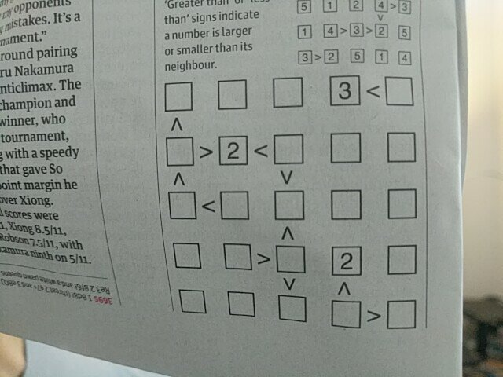
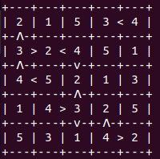

    '||''''|            ||                 '||          '||              .|'''|         '||`                      
     ||  .              ||                  ||      ''   ||       ''     ||              ||                       
     ||''|   '||  ||` ''||''  .|''|, (''''  ||''|,  ||   || //`   ||     `|'''|, .|''|,  ||  \\  // .|''|, '||''| 
     ||       ||  ||    ||    ||  ||  `'')  ||  ||  ||   ||<<     ||      .   || ||  ||  ||   \\//  ||..||  ||    
    .||.      `|..'|.   `|..' `|..|' `...' .||  || .||. .|| \\.  .||.     |...|' `|..|' .||.   \/   `|...  .||.   
                                                                                                              
                                                                                                       
An [OR-TOOLS](https://developers.google.com/optimization/) based solver of Futoshiki (不等式) puzzles from images

# Example

### Input Puzzle


### Solution


### In Real Time


# Requirements

```bash
pip install -r requirements.txt
```

The latest version of [tesseract-ocr](https://github.com/tesseract-ocr/tesseract) is also required. This can easily be installed with:

```bash
sudo apt install tesseract-ocr
```

Depending on your OS and version of tesseract, you may also have to download the eng.traineddata file from [here](https://github.com/tesseract-ocr/tessdata). It should be placed in `/usr/local/share/tessdata`and the environment variable `TESSDATA_PREFIX` should be set to equal this path:

On Unix - `export TESSDATA_PREFIX=/usr/local/share/tessdata`

# Running
```bash
cd main/
python main.py
```

Press SPACE to run the initial capture - after this the capture window will close, but images will continue to be captured from the semantic segmentation model predictions until a solution(s) for the puzzle is found

# Write ups

[Medium - Solving Futoshiki Puzzles in Python](https://medium.com/swlh/solving-futoshiki-puzzles-in-python-d2c3caea3dd2)
[Medium - Building a Custom Semantic Segmentation Model](<<add link here>>)